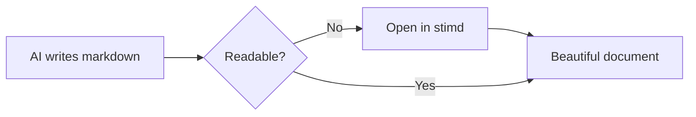
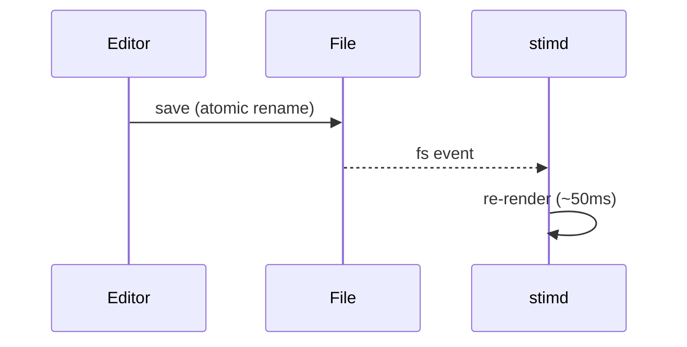
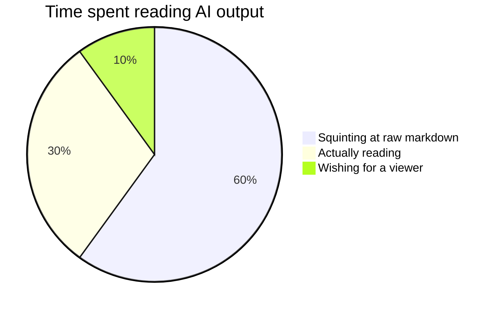

# stimd Demo Document

Like Preview.app for PDFs — but for **Markdown**. This file exercises everything the
viewer renders. Edit it in any editor and watch the window update live.

## Text Styling

You can write in *italic*, **bold**, ***bold italic***, ~~strikethrough~~, and
`inline code`. Here's a [link to Daring Fireball](https://daringfireball.net/projects/markdown/)
and an autolink: <https://example.com>.

> Blockquotes look like this. They can span multiple lines and contain
> `code`, **bold text**, and other inline formatting.

## Task Lists

- [x] Render Markdown beautifully
- [x] Mermaid diagrams
- [x] Syntax highlighting
- [ ] World domination

## Tables

| Feature        | Status | Notes                          |
|:---------------|:------:|-------------------------------:|
| Headings       |   ✅   | h1–h6 with anchor links        |
| Tables         |   ✅   | alignment + zebra striping     |
| Code blocks    |   ✅   | highlight.js, dozens of langs  |
| Mermaid        |   ✅   | flowchart, sequence, pie, more |
| Live reload    |   ✅   | ~50 ms after save              |

## Code

```swift
struct Greeter {
    let name: String

    func greet() -> String {
        // String interpolation, very fancy
        return "Hello, \(name)!"
    }
}

print(Greeter(name: "world").greet())
```

```python
def fib(n: int) -> int:
    """Return the nth Fibonacci number."""
    a, b = 0, 1
    for _ in range(n):
        a, b = b, a + b
    return a

print([fib(i) for i in range(10)])
```

```javascript
const debounce = (fn, ms = 50) => {
  let t;
  return (...args) => {
    clearTimeout(t);
    t = setTimeout(() => fn(...args), ms);
  };
};
```

## Mermaid Diagrams

### Flowchart



### Sequence Diagram



### Pie Chart



## Ordered Lists

1. First item
2. Second item
   1. Nested item
   2. Another nested item
3. Third item

---

## The Long Tail

### Deeply Nested Heading

#### Even Deeper

That's the tour. Press <kbd>Space</kbd> on this file in Finder for the
QuickLook preview, ⌘P to print or save a PDF, and pinch or ⌘-scroll to zoom.
